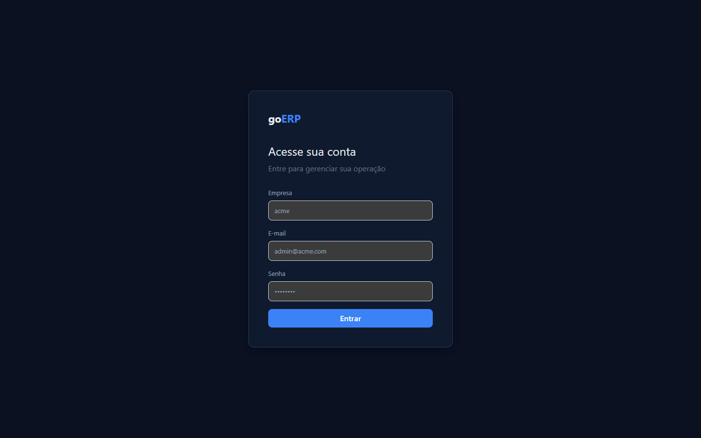
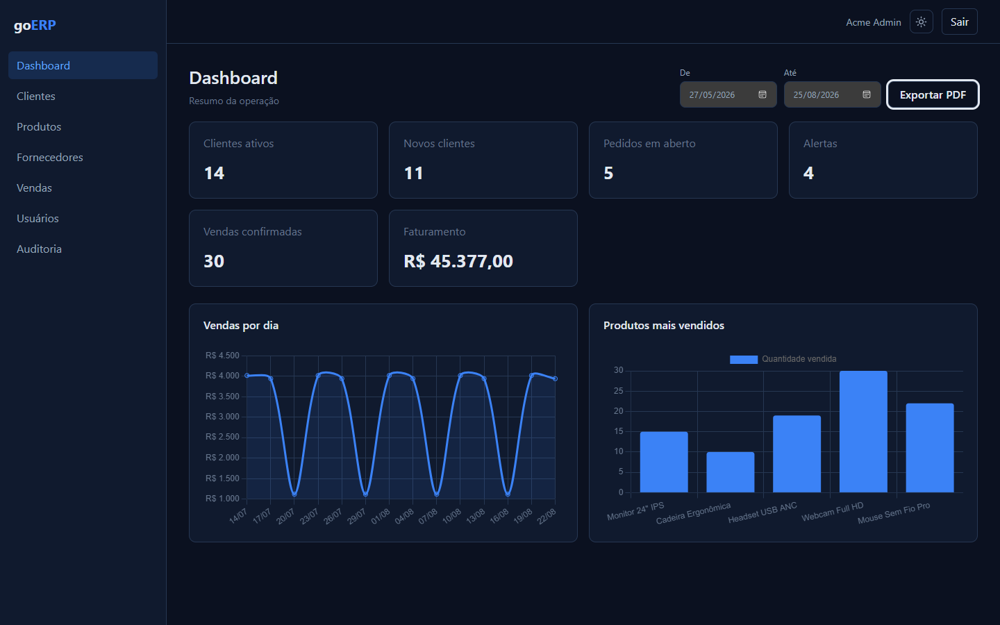
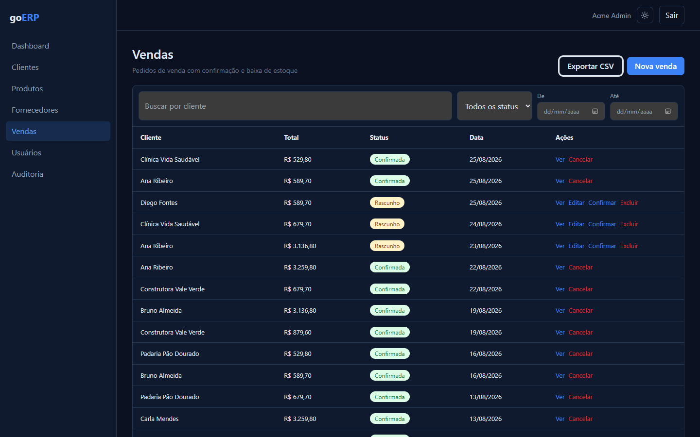
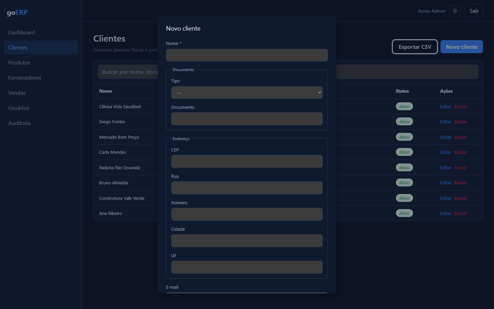
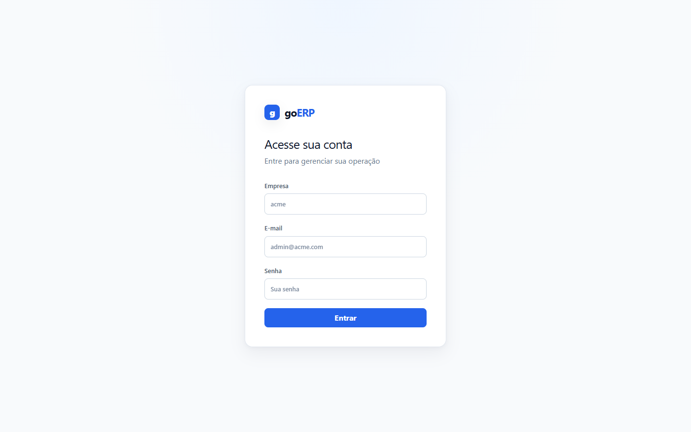
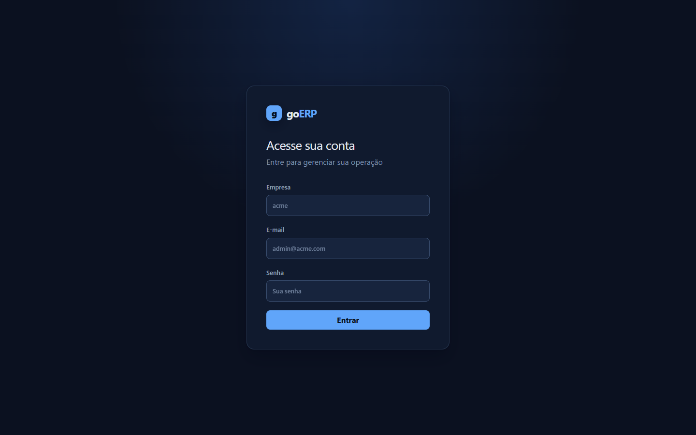

# goERP

[](https://github.com/MaiconGambini/erpGolang/actions/workflows/backend.yml)
[](https://github.com/MaiconGambini/erpGolang/actions/workflows/frontend.yml)
[](https://github.com/MaiconGambini/erpGolang/actions/workflows/e2e.yml)
[](LICENSE)

**Multi-tenant ERP core modules** for small businesses — Go + Vue 3 + PostgreSQL.  
Auth, catalog CRUD, sales with stock control, RBAC, CSV/PDF reports, and dashboard charts.  
*Not fiscal invoicing (NF-e) or full finance — see [scope](#scope).*

---

## Screenshots

| Login | Dashboard (KPIs + charts) |
|-------|---------------------------|
|  |  |

| Sales workflow | Customer form (BR fields) |
|----------------|---------------------------|
|  |  |

| Login — light mode | Login — dark mode |
|--------------------|-------------------|
|  |  |

---

## For reviewers (2 minutes)

1. From the repository root, create the local environment file.

   ```bash
   cp backend/.env.example backend/.env
   ```

2. Start local infrastructure.

   ```bash
   docker compose -f docker-compose.dev.yml up -d
   ```

3. In terminal 1, use Bash/Git Bash to run migrations and seed data.

   ```bash
   cd backend
   set -a
   source .env
   set +a
   go run ./cmd/migrate
   go run ./cmd/seed
   ```

4. In terminal 2, start the backend API.

   ```bash
   cd backend
   go run ./cmd/api
   ```

5. In terminal 3, install frontend dependencies and start the dev server.

   ```bash
   cd frontend
   npm install
   npm run dev
   ```

6. Log in with the local seed-only admin credentials: tenant `acme`, `admin@acme.com`, `admin123`.
7. Try: create customer → product → draft sale → confirm → dashboard KPIs update

Local seed-only viewer credentials: `viewer@acme.com` / `admin123` (read-only, no delete).

---

## Scope

**In scope:** multi-tenant isolation, JWT auth, customers/products/suppliers/sales CRUD, sales confirm/cancel + stock, dashboard KPIs + charts, CSV export, PDF reports, RBAC, users admin, audit log viewer.

**Out of scope:** NF-e, payments/AP/AR, purchase orders, stock ledger, live hosted demo.

---

Inspired by learning-oriented READMEs like [person-crud](https://github.com/KozielGPC/person-crud), the sections below describe **what the project teaches** and **how the system works**.

## What I Learned Building This Project

### Backend (Go)

- **Modular monolith composition** — registering domain modules behind a single `app.Module` interface and chi router.
- **Multi-tenant isolation** — every tenant-owned table has `tenant_id`; JWT claims feed `tenantctx`; cross-tenant access returns `404` (not `403`).
- **RBAC middleware** — `RequireRole` enforces route permissions; viewer is read-only.
- **Typed SQL with sqlc** — queries live in `.sql` files; generated Go code removes stringly-typed SQL in handlers.
- **Transactional workflows** — sales `confirm` / `cancel` use `pgx` transactions to update status and product stock atomically.
- **Concurrency control** — race between concurrent confirms closed with `SELECT ... FOR UPDATE` row locking plus a conditional `UPDATE ... WHERE status = $from`; pinned by a deterministic concurrency regression test (`TestConcurrentConfirmSingleDecrement`).
- **Contract-first API** — OpenAPI 3.0 spec (`contract/openapi.yaml`) covering all 40 routes, documenting real envelope behavior.
- **Redis rate limiting** — sliding login throttle (`INCR` + `EXPIRE`, 5 attempts / 15 min per IP) that degrades open when Redis is unavailable.
- **Reporting read-model** — dashboard KPIs, sales-by-day, top products, CSV export, PDF via gofpdf.
- **Audit trail** — append-only `audit_logs` on business writes; admin audit log viewer.

### Frontend (Vue 3)

- **Feature-Sliced Design (FSD)** — `entities` → `features` → `widgets` → `pages`.
- **TanStack Vue Query** — server state, cache invalidation, dashboard refresh after mutations.
- **Role-aware UI** — hide create/edit/delete for viewer; admin-only users and audit routes.
- **Chart.js dashboard** — date range picker, sales line chart, top products bar chart.
- **E2E with Playwright** — auth, CRUD, sales, dashboard KPIs, charts, export, viewer smoke.

### DevOps & Reliability

- **CD to Fly.io** — deploy gated on green Backend CI.
- **Operable backups** — verified `pg_dump`/`pg_restore` scripts with integrity gate, retention tiers and a documented restore drill (row-count matched against live data).
- **CI pipelines** — backend lint/test/integration + coverage, frontend typecheck/unit/build, Playwright E2E.

### Architecture Patterns

| Pattern | Where |
|---|---|
| Entity CRUD | `customers`, `products`, `suppliers` |
| Workflow + transactions | `sales` (draft → confirm → cancel) |
| Read-model aggregate | `dashboard`, `reports` |
| RBAC guards | middleware + router `requireAdmin` |

---

## The System

goERP delivers authentication, tenant isolation, catalog CRUD, sales with stock effects, RBAC, reporting, and a live dashboard.

```text
Browser
  → Vue 3 (FSD) + Vue Query + Pinia
  → REST API (/api/v1)
  → Go modular monolith (chi)
  → PostgreSQL 16 (source of truth)
  → Redis 7 (login rate limit)
```

### Backend Modules

| Module | Responsibility |
|---|---|
| `auth` | Login, refresh, logout, me |
| `tenants` | Current tenant info |
| `customers` | Reference CRUD module |
| `products` | Catalog, stock, low-stock list |
| `suppliers` | Supplier CRUD |
| `sales` | Draft sales, confirm (stock −), cancel (stock +) |
| `dashboard` | KPI aggregate (6 metrics; financial KPIs redacted for operator/viewer) |
| `reports` | Sales-by-day, top products, sale PDF, period summary PDF |
| `users` | List/get/update users (admin) |
| `audit` | Write-side recorder + admin audit log list |

### API Conventions

- Single resource: `{ data: T }`
- Paginated list: `{ data: T[], pagination }`
- Error: `{ error: { code, message, details? } }`
- CSV export: `?format=csv` on list endpoints
- Tenant scope from JWT — never from request body

### Frontend Routes

| Route | Screen |
|---|---|
| `/login` | Tenant slug + email + password |
| `/` | Dashboard KPIs + charts + PDF export |
| `/customers` | Customer CRUD + CSV export |
| `/products` | Product CRUD + CSV export |
| `/suppliers` | Supplier CRUD + CSV export |
| `/sales` | Sales list, confirm, cancel, CSV + date filter |
| `/users` | User admin (admin only) |
| `/audit` | Audit log viewer (admin only) |

### Reporting

- **CSV** — customers, products, suppliers, sales (`?format=csv`; sales supports `from`/`to`)
- **PDF** — sale detail (`GET /reports/sales/{id}/pdf`), period summary (`GET /reports/sales-summary.pdf`)
- **Charts** — sales by day, top products (dashboard date range; admin/manager only)

### Auth Flow

1. `POST /auth/login` with `tenantSlug`, `email`, `password` → access token + user JSON.
2. Refresh token set as HttpOnly cookie (`Secure` in production).
3. Axios sends `Authorization: Bearer`; on `401`, single-flight `POST /auth/refresh` then retry.
4. Logout clears cookie and `queryClient.clear()`.

### Database

PostgreSQL tables: `tenants`, `users`, `auth_sessions`, `customers`, `products`, `suppliers`, `sales`, `sale_items`, `audit_logs`.

Sales lifecycle: `draft` → `confirmed` → `cancelled`. Stock changes only on confirm/cancel.

Seed data uses local seed-only credentials (never use in production): `acme` / `beta` — `admin@*.com` / `admin123`; viewer: `viewer@acme.com` / `admin123`.

---

## Usage

### Prerequisites

- Go 1.25+
- Node.js 20+
- Docker (for Postgres + Redis)

### Local run (5 steps)

`docker-compose.dev.yml` publishes **Postgres on host port `5434`** and **Redis on `6381`**. Full runbook: [`backend/docs/LOCAL_DEV.md`](backend/docs/LOCAL_DEV.md).

**1. Environment**

```bash
cp backend/.env.example backend/.env
# Set JWT_ACCESS_SECRET and JWT_REFRESH_SECRET (non-default values)
```

**2. Infrastructure**

```bash
docker compose -f docker-compose.dev.yml up -d
```

**3. Database**

```bash
(
  cd backend
  set -a
  source .env
  set +a
  go run ./cmd/migrate
  go run ./cmd/seed
)
```

**4. Backend**

```bash
(
  cd backend
  go run ./cmd/api
)
```

API: `http://localhost:8080` — health: `/healthz`, `/readyz`

**5. Frontend**

```bash
(
  cd frontend
  npm install
  npm run dev
)
```

App: `http://localhost:5173` (proxies `/api` → backend).

### Tests

```bash
# Backend
(cd backend && go test ./...)
(cd backend && go test -tags=integration ./internal/customers/... ./internal/dashboard/... ./internal/sales/... ./internal/reports/...)

# Frontend
(cd frontend && npm install)
(cd frontend && npm run typecheck)
(cd frontend && npm run test:unit)
(cd frontend && npx playwright install chromium)  # first run

# E2E (docker-compose.dev.yml up; 21 tests, global-setup migrates + seeds)
(cd frontend && npx playwright test)

# Full gate
make validate
```

---

## Target Stack

| Layer | Technologies |
|---|---|
| Backend | Go 1.25+, chi, pgx, sqlc, Atlas, Redis, JWT, bcrypt, slog, gofpdf |
| Frontend | Vite, Vue 3, TypeScript, Pinia, TanStack Vue Query, PrimeVue, Tailwind, Chart.js |
| Data | PostgreSQL 16, Redis 7 |
| Deploy | Docker Compose + Caddy (VPS), Fly.io (API CD) |

---

## Repository Layout

```text
backend/                 Go API, migrations, sqlc queries
frontend/                Vue 3 FSD application
assets/images/           README screenshots
backend/docs/            Backend-specific runbooks
deploy/                  Production compose + Caddy
docker-compose.dev.yml   Local PostgreSQL and Redis
LICENSE                  MIT
SECURITY.md              Vulnerability reporting
```

---

## Tasks

### Backend

- [x] Modular monolith with `app.Module` registration
- [x] Multi-tenant schema and middleware
- [x] Auth: login, refresh rotation, logout, JWT
- [x] Role-based access control (RBAC)
- [x] Customers CRUD + audit + integration tests
- [x] Products CRUD + low-stock endpoint
- [x] Suppliers CRUD
- [x] Sales workflow (confirm/cancel + stock transactions)
- [x] Dashboard KPI aggregate (6 KPIs)
- [x] CSV export on list endpoints
- [x] PDF reports (sale + summary)
- [x] Users list/edit (admin)
- [x] Audit log list (admin)
- [x] Sales + reports integration tests in CI
- [x] OpenAPI contract (`contract/openapi.yaml`, 40/40 routes)

### Frontend

- [x] FSD structure with entity API clients
- [x] Auth boot + axios refresh interceptor
- [x] CRUD pages: customers, products, suppliers, sales
- [x] Dashboard with KPIs, charts, date range, drill-downs
- [x] CSV export toolbar buttons
- [x] PDF download (sale detail + dashboard summary)
- [x] Users + audit admin pages
- [x] Role-based UI (viewer read-only)
- [x] Playwright E2E suite

### DevOps

- [x] GitHub Actions: backend, frontend, E2E workflows
- [x] Backend coverage profile in CI
- [x] Fly deploy gated on Backend CI
- [x] VPS production compose + Caddy
- [x] VPS deploy automation in CI (`.github/workflows/deploy-vps.yml`; manual dispatch)

---

## Documentation

| Doc | Purpose |
|---|---|
| [`ARCHITECTURE.md`](ARCHITECTURE.md) | System shape and module boundaries |
| [`backend/docs/`](backend/docs/) | Auth, schema, tenant isolation, sales transactions |
| [`SECURITY.md`](SECURITY.md) | Report security issues |

---
